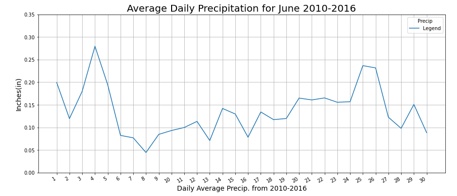
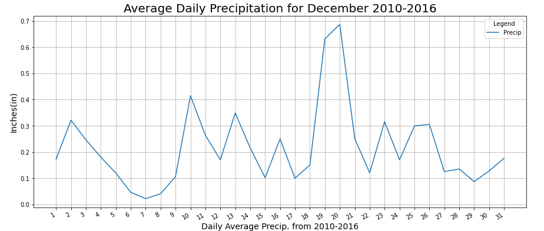

# Surfs_Up

## Overview of the Analysis
The analysis is designed to put together a plan for the surf shop in Hawaii, on the island of Oahu. An investor who would like to analysis precipitation data for six year period in June and December. By making this analysis repeatable, the ability to analyze other locations for future business opportunities. 

## Results
 * The average temperature in June is 75 Fahrenheit with December roughly 4 degrees lower at 70.
 * The lowest temp seen in June was 64 degrees with December's lowest recorded temp at 56.
 * The ranges for June quartile were 73 and 77. The December quartiles were 69 and 74 degrees. 
 * Interesting to note that the June data had slightly more data counts vs the December weather data. 
## Summary
Looking at the data that we collected, we were able to analyze the temperature data year round at this location. The precipitation data below in the two images shows the variability over a six year period, broke up by different months. 

